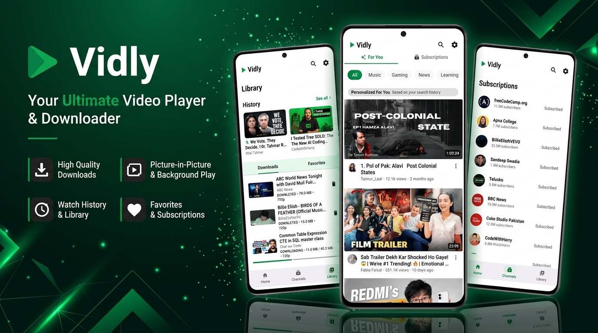

# Vidly

### A fast, private, and feature‑rich YouTube client for Android

**No ads · No tracking · No data collection**

 

  
  
  
  
  
  

  

 

 

---

## What’s New / Changes from the Original PlayTube

This project is a **modified fork** of the original <a href="https://github.com/arslandaim-hub/PlayTube">PlayTube</a>. While keeping the core experience, I’ve added significant improvements and new features:

### Security & Privacy Fixes
- Removed the fake PoToken system – no more random 403 errors during playback.
- Database upgrades no longer wipe your watch history.
- Cloud backup is now locked down – Room database and DataStore are excluded from Google backups.
- MediaSession is locked to the app – no other app can hijack your player.

### Critical Bug Fixes
- Fixed the endless recovery loop – now limits retries to 3 attempts with backoff.
- Chunked downloads now require HTTP 206 – no more corrupted downloaded files.
- Resume download is now accurate – progress never exceeds 100%.
- Backup restore no longer "falsely succeeds" – proper validation and 256 MB decompression limit.
- Auto‑advance now cleans up stale SponsorBlock state.
- Thread‑safe operations for downloads and network calls.

### New Features
- **YouTube‑style fullscreen button** – bottom‑right corner, immersive landscape mode.
- **Playback Queue Management** – explicit queue, drag‑to‑reorder, shuffle, repeat modes.
- **Audio‑only downloads** – best available audio track saved as `.m4a`/`.opus` in the Music folder.
- **Subtitle downloads** – download WebVTT subtitles per language.
- **Private (Incognito) mode** – browse without leaving any trace; all history from the session is purged on exit.
- **Biometric app lock** – full‑screen lock with fingerprint/face unlock (falls back gracefully if no authenticator is registered).

> These changes make Vidly more stable, private, and feature‑complete than the original PlayTube.
> Look at the [Full Changelog](./Changelog.md) to see all the update details.
---

## Features

* **Fluid Glass UI:** A modern, dynamic, and smooth full‑screen browsing experience.
* **Background Playback:** Continue listening with full media controls.
* **Picture‑in‑Picture:** Watch videos while using other apps.
* **Comments and Replies:** Browse comments and view replies.
* **Multi‑language Subtitles:** Watch content with subtitle support.
* **Incognito Mode:** Browse without affecting personalized recommendations.
* **High‑Quality Downloads:** Download supported content in high quality.
* **Gesture Controls:** Control brightness, volume, and playback with gestures.
* **Orientation Controls:** Easily switch between portrait and landscape modes.
* **Subscription Management:** Subscribe to and manage channels without a Google account.
* **Privacy First:** No ads, tracking, or unnecessary data collection.

### Personalized Recommendations

Vidly includes a lightweight recommendation system that learns from user activity to provide more relevant video suggestions.

Recommendation learning can be paused, and learned data can be cleared at any time from the app settings.

---

## Technology Stack

| Category                 | Technology         | Description                                    |
| ------------------------ | ------------------ | ---------------------------------------------- |
| **Architecture**         | MVVM               | Model-View-ViewModel architecture              |
|                          | Clean Architecture | Separation between Domain, Data, and UI layers |
|                          | Repository Pattern | Centralized data access and management         |
| **Kotlin and Reactive**  | Kotlin Coroutines  | Asynchronous and background operations         |
|                          | StateFlow          | Reactive UI state management                   |
| **UI**                   | Jetpack Compose    | Modern declarative Android UI                  |
|                          | Material Design 3  | Modern components and dynamic theming          |
|                          | Compose Animations | Smooth transitions and UI animations           |
| **Storage**              | Room Database      | Local storage for user metadata                |
|                          | Jetpack DataStore  | User preferences and application settings      |
| **Media and Networking** | AndroidX Media3    | Video and audio playback                       |
|                          | Coil 3             | Image loading and caching                      |
|                          | NewPipeExtractor   | Stream and metadata extraction                 |
|                          | OkHttp             | HTTP networking                                |
| **Background and DI**    | Hilt (Dagger)      | Dependency injection                           |
|                          | WorkManager        | Reliable background tasks and downloads        |
| **Build Tools**          | KSP                | Kotlin Symbol Processing                       |
|                          | Version Catalogs   | Centralized dependency and version management  |

---

## Acknowledgements

Vidly would not have been possible without the work of the open‑source community.  
Special thanks to:
* [NewPipe](https://newpipe.net/)
* [NewPipe Extractor](https://github.com/TeamNewPipe/NewPipeExtractor)
* [LibreTube](https://github.com/libre-tube/LibreTube)
* [PipePipe](https://github.com/InfinityLoop1308/PipePipe)
* [Flow](https://github.com/arslandaim-hub/Flow)

…and, of course, the original **PlayTube** project – the foundation on which this fork is built.

---

## Important Notice

> [!WARNING]
> Publishing this application on the Google Play Store may violate Google's policies and/or the platform's terms of service. Always review the applicable policies and terms before distributing the application.

---

## License and Code Usage

Vidly is licensed under the **GNU General Public License v3.0 (GPL-3.0)**.

You are free to:

* Use the source code.
* Study how the application works.
* Modify the source code.
* Fork the project.
* Redistribute copies of the project.

### If You Modify or Redistribute Vidly

When distributing a modified or derivative version of Vidly, you must comply with the GPL‑3.0 license.

This includes:
* Keeping GPL‑covered code under the GPL‑3.0 license.
* Providing the corresponding source code when required by the license.
* Preserving applicable copyright and license notices.
* Making GPL‑covered source code available to recipients under GPL‑3.0.
* Clearly documenting significant changes made to the original code.

For the complete license terms, see the [LICENSE](LICENSE) file.

---

### If you enjoy Vidly, consider giving the project a star

It helps more people discover the project and supports its continued development.

